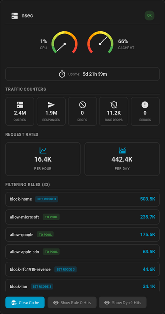

# PowerDNS **dnsdist** — Home Assistant Integration

[](#changelog)
[](https://www.home-assistant.io/)
[](https://dnsdist.org)
[](https://github.com/renaudallard/homeassistant_dnsdist/actions/workflows/hacs-validation.yml)
[](https://github.com/renaudallard/homeassistant_dnsdist/actions/workflows/ruff.yml)
[](https://github.com/renaudallard/homeassistant_dnsdist/actions/workflows/tests.yml)
[](https://github.com/renaudallard/homeassistant_dnsdist/actions/workflows/mypy.yml)
[](LICENSE)

A secure, high-performance bridge between **PowerDNS dnsdist 2.x** and **Home Assistant 2025.10+**.
Monitor every proxy, surface aggregated insights, and control dnsdist safely through REST-only actions.

<p align="center">
  
</p>

| | |
|---|---|
| **Integration type** | Hub (per-host and per-group devices) |
| **Domain** | `dnsdist` |
| **Current version** | **1.4.1** |
| **Home Assistant** | **2025.10+** |
| **dnsdist** | **2.x** |
| **License** | [MIT](LICENSE) |

---

## Table of Contents

- [Features](#features)
- [Installation](#installation)
- [Configuration](#configuration)
- [Entities](#entities)
- [Lovelace Card](#lovelace-card)
- [Options](#options)
- [Services](#services)
- [Troubleshooting](#troubleshooting)
- [File Map](#file-map)
- [Changelog](#changelog)
- [License](#license)

---

## Features

- **UI-only setup** with zero YAML required
- **Multiple hosts**, each dnsdist endpoint becomes its own device
- **Aggregated groups** with smart rollups (sum counters, average CPU, max uptime, priority security status)
- **Filtering rule sensors** for per-rule match counts with idle/active icons
- **Dynamic rule sensors** for temporary blocks (dynblocks) from rate limiting and DoS protection
- **Custom Lovelace card** with gauges, counters, filtering rules, and dynamic rules
- **Long-term statistics ready** sensors (`TOTAL_INCREASING` counters, `MEASUREMENT` percentages)
- **Rolling request rates** (`req_per_hour`, `req_per_day`) with history persistence across restarts
- **Secure by default** with HTTPS and SSL verification
- **Diagnostics bundle** with automatic secret redaction
- **REST-only services**: `clear_cache`, `enable_server`, `disable_server`, `get_backends`
- **Reconfigurable** connection parameters (host, port, API key, SSL) without removing the entry

---

## Installation

> Requires Home Assistant **2025.10** or newer.

1. Copy `custom_components/dnsdist/` into your Home Assistant `config/custom_components/` directory
2. Restart Home Assistant
3. Go to **Settings > Devices & Services > + Add Integration** and pick **PowerDNS dnsdist**

**HACS:** Add this repository as a custom source or install directly if public.

---

## Configuration

### Add a Host

| Field | Description |
|---|---|
| **Name** | Display name for Home Assistant |
| **Host / Port** | dnsdist API endpoint (default port `8083`) |
| **API Key** | Optional |
| **Use HTTPS / Verify SSL** | Toggle TLS and certificate validation |
| **Update interval** | Polling frequency in seconds (default `30`) |
| **Include filtering rule sensors** | Disabled by default |

Host validation enforces RFC 1123 hostnames plus IPv4/IPv6 literals.
Setup requires a valid dnsdist statistics JSON payload before finishing, so wrong URLs or non-dnsdist endpoints fail fast.

### Add a Group

| Field | Description |
|---|---|
| **Group name** | Home Assistant device label |
| **Members** | Choose from existing host names |
| **Update interval** | Default `30` seconds |
| **Include filtering rule sensors** | Enabled by default |

Group rollups: **sum** (counters), **avg** (CPU %), **max** (uptime), and priority **security status** (critical > warning > ok > unknown).

---

## Entities

Each host or group creates a Home Assistant device with these sensors:

| Sensor | Unit | State class |
|---|---|---|
| `queries`, `responses`, `drops`, `rule_drop`, `downstream_errors`, `cache_hits`, `cache_misses` | count | `TOTAL_INCREASING` |
| `cacheHit`, `cpu` | % | `MEASUREMENT` |
| `uptime` | seconds | `MEASUREMENT` |
| `req_per_hour`, `req_per_day` | count | `MEASUREMENT` |
| `security_status` | string | - |

Additional dynamic sensors:

- **Filtering rule sensors** (`Filter <rule name>`) with per-rule match counts and idle/active icons
- **Dynamic rule sensors** (`Dynblock <network>`) with reason, action, time remaining, and eBPF status

> Rate sensors are extrapolated from available history until enough data is collected (1h / 24h), then switch to actual measured values.

---

## Lovelace Card

The integration includes a custom Lovelace card that is automatically registered on load.

**Features:** security status badge, CPU and cache hit needle gauges, uptime display, traffic counters grid, request rate tiles, filtering rules list sorted by match count, dynamic rules list, show/hide zero-hit toggle buttons, clear cache button with confirmation, light/dark theme support, compact mode for sidebars.

### Manual resource registration

If needed, go to **Settings > Dashboards > Resources** and add `/dnsdist_static/dnsdist-card.js?v=1.4.1` as a JavaScript Module.

### Usage

Add the card via the UI card picker (search for "dnsdist") or manually:

```yaml
type: custom:dnsdist-card
entity_prefix: dns1              # Required: matches your dnsdist device name
title: My DNS Server             # Optional: custom card title
show_filters: true               # Optional: show filtering rules (default: true)
show_dynamic_rules: true         # Optional: show dynamic rules (default: true)
show_actions: true               # Optional: show action buttons (default: true)
compact: false                   # Optional: compact mode for sidebars (default: false)
```

| Option | Type | Default | Description |
|---|---|---|---|
| `entity_prefix` | string | *required* | Device name prefix for entity IDs |
| `title` | string | entity_prefix | Custom card title |
| `show_filters` | boolean | `true` | Show filtering rules section |
| `show_dynamic_rules` | boolean | `true` | Show dynamic rules section |
| `show_actions` | boolean | `true` | Show action buttons |
| `compact` | boolean | `false` | Compact mode for sidebars |

A visual configuration editor is also available through the Lovelace UI.

---

## Options

From the integration options panel:

- Rename a host or group
- Tune the update interval
- Add or remove group members
- Toggle filtering rule sensors (hosts default off, groups default on)
- Optionally delete existing filter sensors when disabling

To change connection parameters (host, port, API key, SSL), use the **Reconfigure** button on the integration card.

---

## Services

All services live under the `dnsdist` domain.
Supplying `host` targets a specific display name; omit it to broadcast to every host (groups excluded).

### `dnsdist.clear_cache`

```yaml
service: dnsdist.clear_cache
data:
  host: "amandil"  # optional
  pool: ""         # optional
```

### `dnsdist.enable_server` / `dnsdist.disable_server`

```yaml
service: dnsdist.enable_server
data:
  host: "amandil"
  backend: "192.168.1.10:53"
```

### `dnsdist.get_backends`

```yaml
service: dnsdist.get_backends
data:
  host: "amandil"  # optional
```

Each host and group device also exposes a **Clear Cache** button. Group presses cascade to all members.

---

## Troubleshooting

| Symptom | Resolution |
|---|---|
| **Request timed out after 10s** | The dnsdist host did not respond in time. Check reachability and webserver load. |
| **Group shows "No active members yet"** | Normal until each member host completes its first refresh. |
| **Counters missing from Recorder** | Counters use `TOTAL_INCREASING` with `count` unit, ensuring long-term statistics work correctly. |
| **Reconfigure connection** | Use the "Reconfigure" button on the integration card to change host, port, API key, or SSL settings. |
| **REST prerequisites** | Ensure the dnsdist webserver is enabled, has an API key, and allows your HA network in the ACL. |

**Diagnostics:** Visit **Settings > Devices & Services > PowerDNS dnsdist > ... > Download diagnostics**. Secrets are automatically redacted.

---

## File Map

```
custom_components/dnsdist/
  __init__.py          config_flow.py       coordinator.py
  manifest.json        options_flow.py      group_coordinator.py
  const.py             sensor.py            button.py
  utils.py             services.py          diagnostics.py
  strings.json         services.yaml
  translations/
    en.json
  brand/               icon.png, logo.png (HA 2026.3+)
  frontend/
    src/               dnsdist-card.ts, dnsdist-card-editor.ts,
                       styles.ts, types.ts
  www/
    dnsdist-card.js    Built card bundle
```

---

## Changelog

### 1.4.1
- Add reconfigure flow to change host, port, API key, and SSL settings without removing the entry
- Log descriptive message for request timeouts instead of empty string

### 1.4.0
- Add local `brand/` directory with `icon.png` and `logo.png` for HA 2026.3+ custom integration branding
- Fix dispatcher signal leak: group coordinators no longer react to reload signals after entry unload
- Fix system diagnostics producing a spurious error entry from the `_services_registered` sentinel
- Fix filtering/dynamic rule preservation: rule sensors now retain last known values when the rules endpoint temporarily fails instead of resetting to zero
- Remove dead `async_get_options_flow` standalone function in options flow module

### 1.3.9
- Replace Lovelace resource polling loop with direct `async_load()` guard
- Fix swallowed `ConfigEntryNotReady` that prevented HA from retrying setup
- Remove dead secret storage API code
- Use identity comparison for `CoreState` enum to match HA core convention

### 1.3.8
- Fix crash on Home Assistant 2026.2+ where `LovelaceData` no longer has a `.mode` attribute

### 1.3.7
- Add separate toggle buttons for filtering rules and dynamic rules with zero matches
- Fix missing ATTR_* constants that caused integration to fail on load

### 1.3.6
- Add toggle button to show/hide dynamic rules with zero hits
- Extrapolate request rates from available history when less than 1h/24h of data
- Fix expired dynblock sensors not being removed from entity registry

### 1.3.3
- Fix OptionsFlow compatibility with newer Home Assistant versions

### 1.3.2
- Fix dynamic rules not being removed from card when they expire
- Fix time remaining countdown not updating in real-time

### 1.3.1
- Redesign gauge layout for more compact display

### 1.3.0
- Add dynamic rules (dynblocks) support with sensors and Lovelace card section
- Group aggregation for dynamic rules with source tracking

### 1.2.1
- Redesign gauge visualization with needle indicator and segmented color gradient arc

### 1.2.0
- Add custom Lovelace card with gauges, counters, filtering rules, and visual editor
- Auto-register frontend resource on integration load

### 1.1.18
- Fix SSL verification logic and improve error handling

### 1.1.17
- Fix schema serialization and config flow validation; add unit tests and CI workflows

### 1.1.16
- Fix linting errors, add missing imports, remove blocking sleep, standardize timeout style

### 1.1.15
- Extract shared utilities into `utils.py` and `HistoryMixin`; centralize constants

### 1.1.14
- Remove deprecated HACS metadata; run HACS validation with default checks

### 1.1.13
- Add HACS validation workflow; align manifests with current requirements

### 1.1.12
- Validate host entries against RFC 1123; verify dnsdist statistics payload during setup

### 1.1.11
- Streamline rolling-window rate calculations

### 1.1.10
- Sanitize backend identifiers in REST services

### 1.1.9
- Preserve query history across restarts for rolling rate sensors

### 1.1.8
- Preload platforms during startup; compatibility fallback for removed `COUNT` unit

### 1.1.7
- Report counters with `count` unit for Recorder statistics

### 1.1.6
- Per-entry control over filtering rule sensors with auto-delete option

### 1.1.5
- Interpolate counters at window horizon for accurate rolling totals

### 1.1.4
- Report actual rolling-window volume instead of extrapolated estimates

### 1.1.3
- Reuse shared HTTP session for all API calls

### 1.1.2
- Switch to REST-only services; single Clear Cache button

### 1.1.1
- Add `req_per_hour` and `req_per_day` sensors; fix duplicate device name in display

### 1.1.0
- HA 2025.10 compatibility; stable entity modeling; robust device identifiers

---

## License

**MIT** -- see [`LICENSE`](LICENSE).
